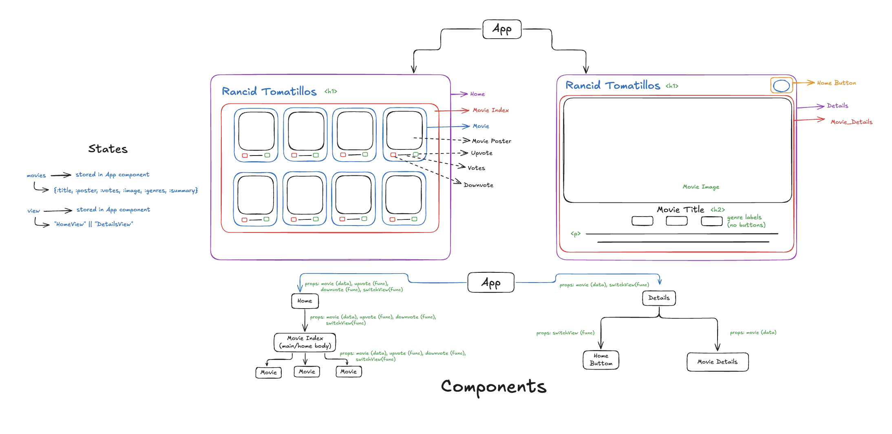

# Rancid Tomatillos

### Deployment via Netlify -> [Rancid Tomatillos](https://steady-druid-f9301f.netlify.app/)

## Description
Rancid Tomatillos is a dynamic web application that provides users with a variety of movies to browse.  Each movie includes detailed information, such as title, genres, and summary.  Additionally, users can interact by upvoting or downvoting movies based on movie preferences.

## Planning

[GitHub Project Board](https://github.com/orgs/My-Turing-Projects-2410/projects/1)

## Tech Stack
- React / JSX / router
- CSS
- Cypress (testing)
- Rancid Tomatillos API

## Installation

1. Fork this repo
2. Clone the repository: `git clone [remote-address] [new-name]`
      For example: `git clone git@github.com:My-Turing-Projects-2410/rancid-tomatillos.git`
3. `cd` into the directory
4. Install dependencies with `npm install`
5. Run this app with `npm start`
6. If not automatically openned, got to `http://localhost:3000/`
7. Enter `control + c` into terminal to stop the app from running

## Contributors

### Elysa Ward
> [LinkedIn](www.linkedin.com/in/elysa-ward)  
> [GitHub](https://github.com/elysableu)

### Kristin Weiland
> [LinkedIn](https://www.linkedin.com/in/kristinweiland/)  
> [GitHub](https://github.com/KMPWeiland)

